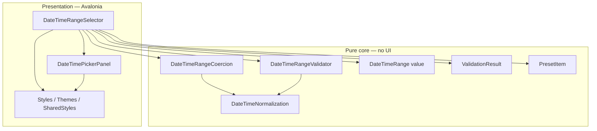

# DateTimeRangeSelector — Краткие требования (только библиотека элементов управления)

Настоящий документ содержит **исключительно требования** для пакета повторно используемых элементов управления UI **`Avalonia.UI.Component`**. 
---

## 1. Назначение

Предоставить элемент управления **`TemplatedControl`** для Avalonia 11, позволяющий пользователям выбирать **диапазон** дат и времени (**From** / **To**) в формате **UTC** с точностью до **миллисекунд**, 
опциональными границами **Min** / **Max**, **пресетами**, **обратной связью валидации** и опциональной **реактивной** (`IObservable`) поверхностью — **без** зависимости от ReactiveUI.

---

## 2. Технический стек

| Область | Требование |
|------|-------------|
| Целевая платформа | **.NET 10** (`net10.0`) |
| Язык | C# 14, nullable reference types включены, implicit usings включены |
| UI-фреймворк | **Avalonia** (зафиксирована в решении; например, линейка **11.3.x**) |
| Зависимости библиотеки | Только **`Avalonia`** + **`System.Reactive`** — **без** ReactiveUI, **без** пакета DataGrid |
| Упаковка | Версии NuGet централизованы (например, через `Directory.Build.props`); проекты ссылаются на свойства, а не на прямые литералы |

---

## 3. Структура папок библиотеки (иллюстративно)

Область действия: только **`src/Avalonia.UI.Component/`**.

```text
src/
├── UTS.DateTimeRangeSelector/
│   ├── Core/                 Чистая предметная область — без ссылок на Avalonia
│   ├── Controls/             TemplatedControls + тип начальной загрузки стилей
│   ├── Events/               Типы аргументов маршрутизируемых событий
│   ├── Converters/           Конвертеры значений XAML
│   ├── Styles/               Темы элементов управления (словари ресурсов AXAML)
│   └── Themes/               Общая настройка тем (Generic + стили селекторов)
├── UTS.DateTimeRangeSelector.Tests/
└── UTS.DateTimeRangeSelector.DemoApp/
```

---

## 4. Архитектура (логические слои)



**Правила**

- **Единственный путь изменения** состояния диапазона: принудительное приведение → запись свойств → валидация → генерация observable / маршрутизируемых событий.
- **Приведение с учётом намерения** (`From` <-> `To` <-> границы Min/Max <-> программная установка) определяет, как восстанавливается условие **From ≤ To** при пересечении конечных точек.
- **UTC** является внутренним контрактом; нормализация не должна искажать **Local** моменты времени.

---

## 5. Функциональные требования — `DateTimeRangeSelector`

### 5.1 Поведение

| ID | Требование |
|----|-------------|
| R1 | Элемент управления является **`TemplatedControl`** **без встроенной ViewModel**. |
| R2 | **FromDateTime** и **ToDateTime** являются авторитетным источником диапазона; значения приводятся к **UTC** после нормализации/приведения. |
| R3 | **MinDateTime** / **MaxDateTime** опциональны; **null** означает отсутствие ограничения для соответствующей границы. |
| R4 | Точность до миллисекунд; формат отображения настраивается (**DateTimeFormat**), шаблон по умолчанию **yyyy-MM-dd HH:mm:ss.fff**. |
| R5 | **TimeProvider** внедряется (CLR-свойство, не styled property) для значений по умолчанию и пресетов; применяется после инициализации, чтобы XAML или инициализатор объекта могли задать его первым. |
| R6 | Начальный диапазон: если потребитель не задал ни одной границы, по умолчанию используется **(текущее время − 1ч, текущее время)** в UTC; если задана только одна граница, вторая выводится логически; явные привязки никогда не перезаписываются значениями по умолчанию. |
| R7 | **Пресеты**: настраиваемый неизменяемый список (**PresetItem**: метка + продолжительность); встроенные значения по умолчанию включают распространённые варианты «последние N часов»; **ShowPresets** переключает видимость. |
| R8 | **Orientation** влияет на расположение областей From/To; шаблон по умолчанию использует перенос строк, чтобы горизонтальные макеты не обрезали область **To** на узких экранах. Действия **пресетов** отображаются **над** From/To. |
| R9 | **Валидация**: предоставляет **IsValid** и **ValidationMessage** (только для чтения) потребителям; сообщение пусто при успешной валидации. |
| R10 | **Маршрутизируемые события**: **RangeChanged** (переход диапазона после приведения), **ValidationChanged** (изменение результата валидации). |
| R11 | **Observables**: **RangeChanges**, **ValidationChanges** — горячие потоки с повтором последнего значения при подписке **после инициализации** (применение шаблона и начальный диапазон); семантика **DistinctUntilChanged**; не завершаются при отсоединении визуального элемента; подписки управляются жизненным циклом потребителя. |
| R12 | Запуск: избегать дублирования эмиссий observables при инициализации; сгенерировать итоговый начальный диапазон и результат валидации один раз после завершения правил инициализации (подписчики до `OnApplyTemplate` получают первое значение при завершении инициализации). |
| R13 | **ApplyPresetCommand**: **ICommand**, совместимый с кнопками пресетов (параметр **TimeSpan**). |
| R14 | Публичные операции: **SetRange**, **ApplyPreset** (только положительная продолжительность), **ResetToDefaults**. |
| R15 | Двусторонние привязки должны сохраняться после приведения (запись через **SetCurrentValue**, чтобы источники привязок обновлялись приведёнными значениями). |

### 5.2 Публичная свойства/методы/события (сводка контракта)

| Вид | Члены |
|------|---------|
| Стилизуемые / прямые свойства | FromDateTime, ToDateTime, MinDateTime, MaxDateTime, Orientation, DateTimeFormat, ShowPresets, Presets, IsValid, ValidationMessage |
| Только CLR | TimeProvider |
| Команды | ApplyPresetCommand |
| Observables | RangeChanges, ValidationChanges |
| Маршрутизируемые события | RangeChanged, ValidationChanged |
| Методы | SetRange, ApplyPreset, ResetToDefaults |

---

## 6. Функциональные требования — `DateTimePickerPanel`

| ID | Требование |
|----|-------------|
| P1 | Вложенный элемент управления для **одного** **SelectedDateTime** в формате **UTC**; **MinDateTime** / **MaxDateTime** привязываются от родителя для ограничения выбора (основное ограничение диапазона обеспечивается на уровне приведения у родителя). |
| P2 | **CalendarDatePicker** для даты; **NumericUpDown** для компонентов времени; опциональный **TextBox** для ввода полной строки даты и времени с задокументированными клавишами подтверждения (Enter / Escape / Tab / потеря фокуса / пустая строка). |
| P3 | Внутренние поля времени не дублируют публичное состояние; композиция/декомпозиция сохраняет **SelectedDateTime** как авторитетный источник. |
| P4 | Доступно маршрутизируемое событие **SelectedDateTimeChanged**; родительский контрол диапазона использует **двустороннюю шаблонную привязку** в качестве основного пути (а не двойную генерацию событий + изменение привязки). |
| P5 | Части шаблона задокументированы. |

---

## 7. Themes и регистрация у потребителя

| ID | Требование |
|----|-------------|
| T1 | Ресурсы **ControlTheme** находятся в объединённых словарях ресурсов, совместимых с правилами Avalonia 11. |
| T2 | **Стили** на основе селекторов размещаются отдельно от определений **ControlTheme**. |
| T3 | Библиотека предоставляет **один** тип точки входа для потребителя (например, подкласс стилей), который объединяет **Generic** + **SharedStyles**, чтобы приложения добавляли один элемент в **Application.Styles** вместе с базовой темой (Fluent/Simple и т.д.). |
| T4 | Поддержка **ThemeDictionaries** для переопределения ресурсов Light/Dark там, где это указано. |

---

## 8. Core

| Тип / область ответственности | Обязательство |
|----------------|------------|
| **DateTimeRange** | Неизменяемое значение диапазона; **Duration**; маркер **Empty**. |
| **ValidationResult** | Валидно / невалидно + сообщение. |
| **PresetItem** | Неизменяемая запись; список **Defaults**. |
| **DateTimeNormalization** | Правила преобразования в UTC: сохранение **Local** момента времени; **Unspecified** помечается согласно контракту. |
| **DateTimeRangeCoercion** | Чистая функция: входные данные = желаемый диапазон, опциональные границы, возвращаемое значение = приведённый диапазон. |
| **DateTimeRangeValidator** | Чистая валидация, включая некорректную настройку Min > Max и диапазон относительно границ. |

---

## 9. Layout

Вертикальное расположение:
```text
┌────────────────────────────────┐
│ [Last 1h] [Last 6h] [Last 24h] │
├────────────────────────────────┤
│ From                           │
│ [Calendar]                     │
│ [HH] : [mm] : [ss] . [fff]     │
│                                │
│ To                             │
│ [Calendar]                     │
│ [HH] : [mm] : [ss] . [fff]     │
│                                │
│ ⚠ From must be <= To           │
└────────────────────────────────┘
```

Горизонтальное расположение:
```text
┌─────────────────────────────────────────────────────────┐
│ [Last 1h] [Last 6h] [Last 24h]                          │
├─────────────────────────────────────────────────────────┤
│ From                       │ To                         │
│ [Calendar]                 │ [Calendar]                 │
│ [HH] : [mm] : [ss] . [fff] │ [HH] : [mm] : [ss] . [fff] │
└─────────────────────────────────────────────────────────┘
```
